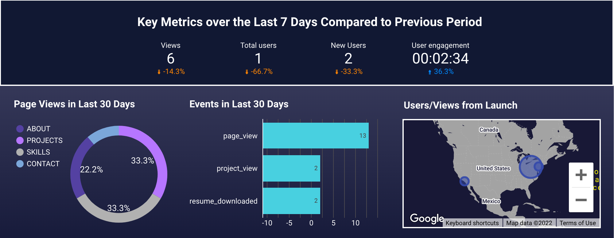

# Website-Tracking-Metrics-Dashboard
  
This dashboard was made by implementing Google Analytics into the code for the website. Once implemented, I used Google Tag Manager to identify events I wanted to track such as which pages where viewed, projects, my resume download link, etc. and removed tracking from other events that I did not want track. Once the dataset was clean and concise I then created this overview dashboard that simply shows variance in views and users from the previous week and a summary of the monthly clicks and engagement that took place.

